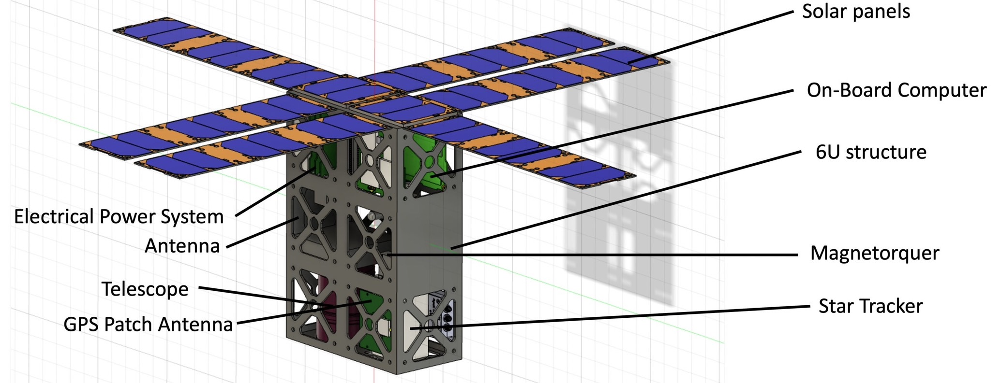
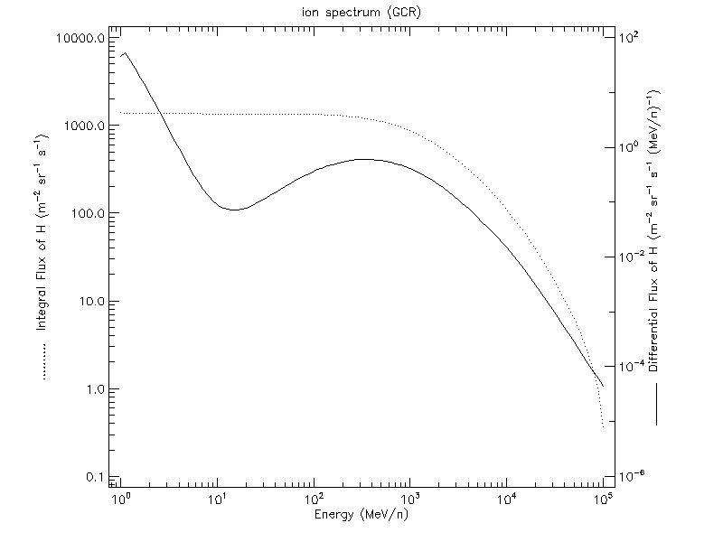
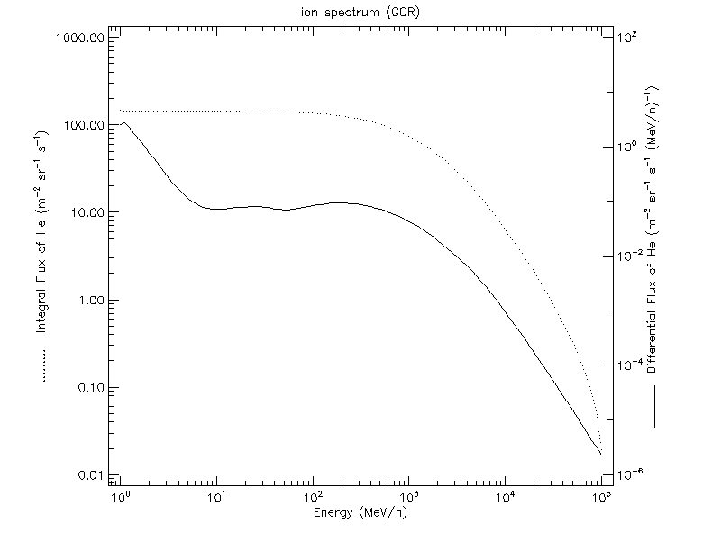
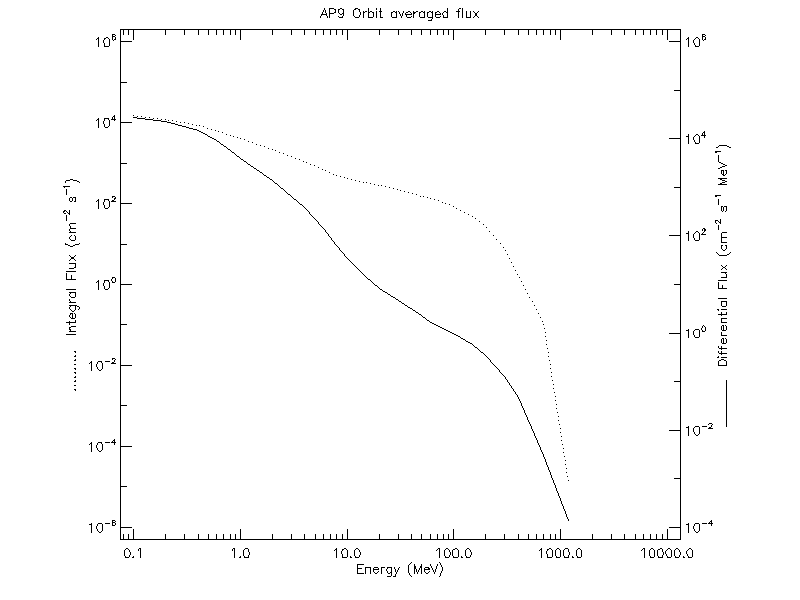
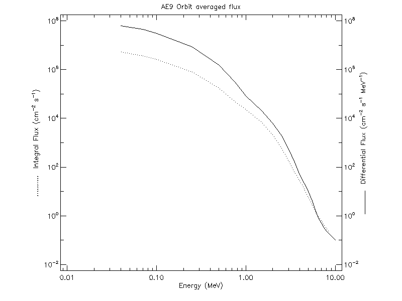

# CubeSat-Geant4

<p align="center">
  
</p>

<p align="center">
<b>Geant4-Based Radiation Simulation Framework for CubeSat Space Missions</b>
</p>

---

## Overview

**CubeSat-Geant4** is a Geant4-based Monte Carlo simulation framework developed to evaluate the radiation environment encountered by CubeSat satellites in Low Earth Orbit (LEO).

The project integrates realistic CAD models of a CubeSat platform with space radiation spectra to simulate particle transport, energy deposition, and detector responses. It provides a flexible platform for radiation shielding analysis, detector design, and mission planning.

The simulation considers multiple radiation sources, including Galactic Cosmic Rays (GCR) and trapped radiation belts (AP-9/AE-9), enabling realistic assessment of radiation effects on CubeSat systems.

---

## Features

- Full Geant4 simulation framework
- Realistic CubeSat CAD geometry
- Monte Carlo particle transport
- Custom detector implementation
- Primary particle generator
- Energy deposition analysis
- Radiation shielding evaluation
- Space radiation spectrum simulation
- Event and run statistics
- 3D visualization support

---

# Simulation Workflow

<p align="center">

```text
 Space Radiation
(GCR / AP9 / AE9)
        │
        ▼
Primary Generator
        │
        ▼
 Geant4 Physics
        │
        ▼
 CubeSat Geometry
        │
        ▼
 Particle Tracking
        │
        ▼
 Sensitive Detector
        │
        ▼
 Energy Deposition
        │
        ▼
 Result Analysis
```

</p>

---

# Project Structure

```text
CubeSat-Geant4
│
├── DetectorConstruction.cc
├── DetectorConstruction.hh
│
├── ActionInitialization.cc
├── PrimaryGeneratorAction.cc
├── RunAction.cc
├── EventAction.cc
├── SteppingAction.cc
│
├── exampleB1.cc
├── exampleB2a.cc
│
├── proton.mac
├── macro file.txt
│
├── payload.jpg
├── overall_Assembly*.stl
├── overall_Assembly*.iges
├── overall_Assembly*.obj
├── overall_Assembly*.sat
│
├── Geant4結果.mp4
├── STK結果.mp4
├── Geant4結果.txt
│
└── README.md
```

---

# CubeSat Model

<p align="center">

</p>

The CubeSat mechanical structure was designed in CAD software and imported into Geant4 for particle transport simulations.

The repository includes several CAD formats:

- STL
- OBJ
- SAT
- IGES
- Fusion360 (.f3d)

allowing easy modification and future expansion.

---

# Space Radiation Environment

The radiation environment used in this project represents the major particle populations encountered by CubeSats operating in Low Earth Orbit (LEO).

The radiation spectra consist of both **Galactic Cosmic Rays (GCR)** and **trapped radiation belt models**. The trapped proton and electron spectra were generated using the **SPENVIS (Space Environment Information System)** platform, which provides internationally recognized space environment models for mission analysis.

## Galactic Cosmic Rays (GCR)

The Galactic Cosmic Ray spectra include the dominant charged particles in deep space radiation.

### Proton Spectrum

<p align="center">

</p>

---

### Helium Spectrum

<p align="center">

</p>

---

## Trapped Radiation Belt

The trapped radiation environment was generated using **SPENVIS**, based on the **AP-9** trapped proton model and the **AE-9** trapped electron model.

### AP-9 Proton Spectrum (SPENVIS)

<p align="center">

</p>

---

### AE-9 Electron Spectrum (SPENVIS)

<p align="center">

</p>

---

# Simulation Components

## DetectorConstruction

Defines

- World volume
- CubeSat geometry
- Material properties
- Sensitive detector locations

---

## PrimaryGeneratorAction

Generates primary particles according to the selected radiation environment.

Supports

- Proton
- Electron
- Helium ion

---

## EventAction

Processes every event during the simulation.

Records

- Detector hits
- Energy deposition
- Event information

---

## RunAction

Responsible for

- Simulation initialization
- Data collection
- Statistical summary

---

## SteppingAction

Tracks every particle step and records interaction information inside the CubeSat.

---

# Physics Processes

The Geant4 simulation models

- Electromagnetic interactions
- Ionization
- Multiple scattering
- Secondary particle generation
- Energy deposition
- Particle trajectories

These processes provide realistic predictions of radiation effects inside spacecraft structures.

---

# Simulation Results

The repository contains several simulation outputs.

## Geant4 Visualization

```
Geant4結果.mp4
```

Visualizes particle transport and interactions inside the CubeSat geometry.

---

## STK Mission Visualization

```
STK結果.mp4
```

Shows the CubeSat mission scenario and orbital environment using AGI Systems Tool Kit (STK).

---

## Numerical Results

```
Geant4結果.txt
```

Contains statistical simulation outputs including energy deposition and detector responses.

---

# Requirements

- Geant4 11.x
- CMake
- C++17
- OpenGL
- Qt Visualization

---

# Build

```bash
mkdir build

cd build

cmake ..

make -j8
```

---

# Run

Example

```bash
./exampleB1 proton.mac
```

or

```bash
./exampleB2a proton.mac
```

---

# Applications

This project can be applied to

- CubeSat Radiation Analysis
- Radiation Shielding Design
- Detector Development
- Space Environment Simulation
- Mission Planning
- Aerospace Research
- Academic Education

---

# Future Work

Future developments may include

- Total Ionizing Dose (TID) analysis
- Single Event Effect (SEE) simulation
- Multi-layer shielding optimization
- GPU acceleration
- Parallel computing
- GDML geometry support
- Automatic result visualization
- Radiation dose mapping

---

# Technologies

- Geant4
- C++
- Monte Carlo Simulation
- CMake
- Fusion 360
- OpenGL
- STK

---

# References

- Geant4 Collaboration  
  https://geant4.web.cern.ch/

- SPENVIS – Space Environment Information System  
  https://www.spenvis.oma.be/

- Ginet, G. P., et al., *AE9, AP9 and SPM: New Models for Specifying the Trapped Energetic Particle and Space Plasma Environment*, Space Science Reviews, 2013.

- ESA Space Environment Information System

---

# License

This project is intended for academic research and educational purposes.

Please cite the Geant4 Collaboration if this project contributes to scientific publications.
